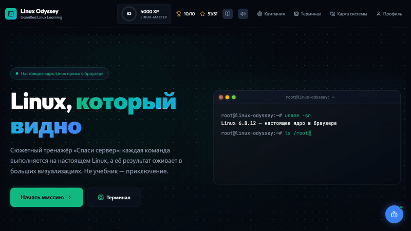
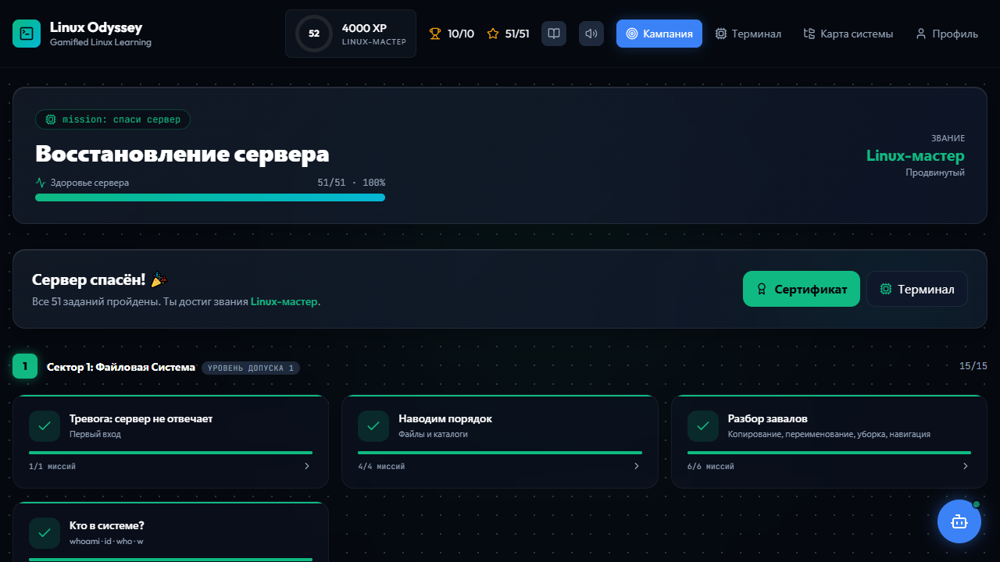
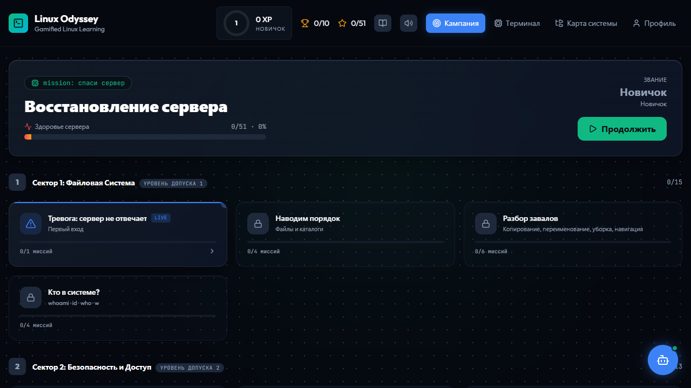
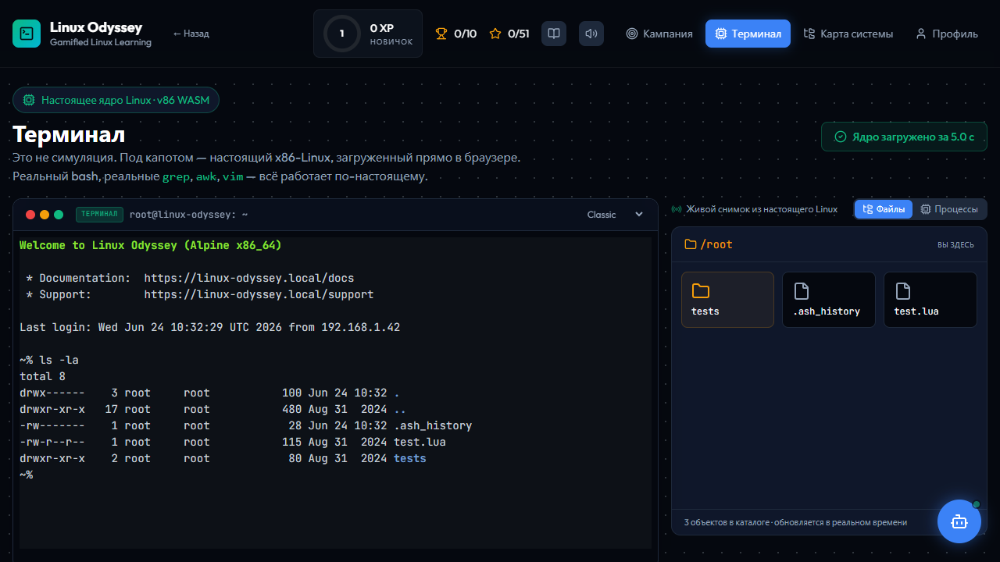
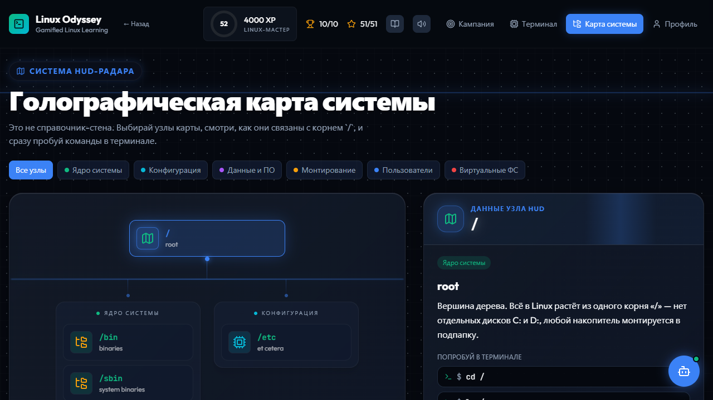
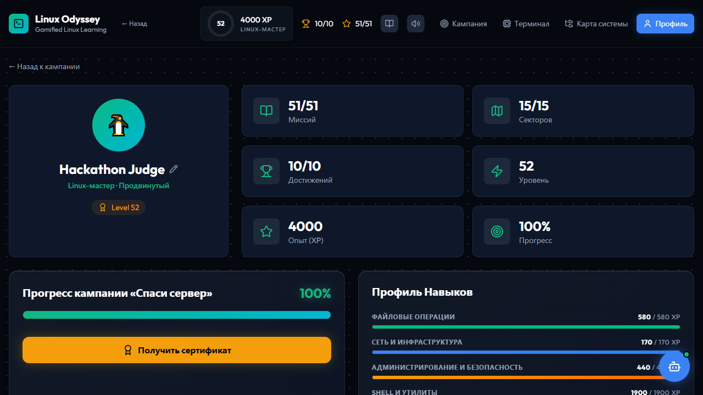
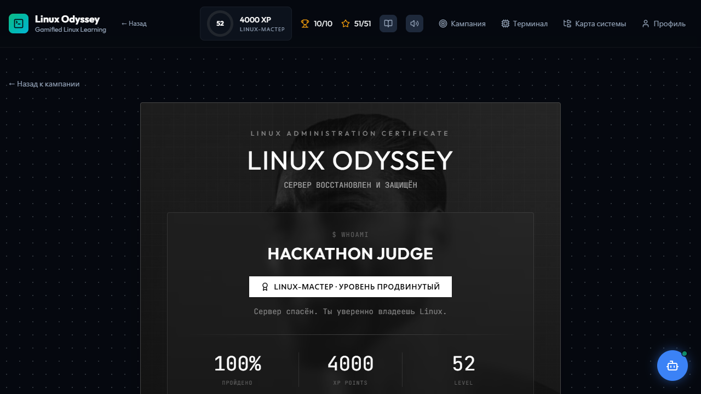

# Linux Odyssey

**Linux, который видно.** Сюжетная кампания, где каждая команда оживает в большой схеме, а под капотом работает **настоящее ядро Linux прямо в браузере**.

### ▶ Открыть без установки: **https://ersssz.github.io/linux-odyssey/**
(Если подключение к интернету слабое то лучше локально запустить)

[](https://github.com/ersssz/linux-odyssey/actions)




## 1. Идея

Голый терминал - это и есть «сухие man-страницы». Linux Odyssey доказывает обратное: **Linux можно увидеть.**

Ты - новый админ, ночью прод-сервер взломали. Проходя **сюжетную кампанию «Спаси сервер»** (15 глав / 51 задание), ты шаг за шагом восстанавливаешь систему: ориентируешься в файлах, чинишь права, ищешь следы в логах, собираешь конвейеры, убиваешь чужой процесс, проверяешь сеть. 

Каждое действие выполняется на **настоящем ядре Linux**, а его результат **видно вживую** в больших центральных визуализациях:
- **FilesystemCanvas** - живая карта каталога: плитки файлов появляются пружинкой при `touch` и исчезают при `rm`.
- **PermissionConfigurator** - грид `rwx`, отражающий настоящие права файла после `chmod`.
- **PipeFlow** - конвейер по стадиям, показывающий как `stdout` перетекает в `stdin`.
- **ProcessMap** - карта процессов настоящего ядра, визуализирующая сигналы `kill` и смерть процессов.

Всё работает прямо в браузере с помощью WebAssembly (эмулятор v86). Никакого "захардкоженного" квеста: задания засчитываются по реальному снимку файловой системы и процессов (через 9p-мост).

## 2. Стек

- **v86** - настоящее ядро Linux в браузере (x86→WASM)
- **xterm.js** (+ addon-fit) - мощный терминал-эмулятор
- **Vite 8 · React 19 · React Router 8 · TypeScript**
- **Tailwind CSS v4 · Framer Motion · Lucide React**
- **canvas-confetti · Web Audio API** (Геймификация и визуальный отклик)
- **Vitest + jsdom · ESLint + Prettier** (Чистый и протестированный код)
- **Docker + Nginx** (production build, настроенные заголовки COOP/COEP для SharedArrayBuffer)

## 3. Запуск

Проще всего - **открыть живую ссылку выше, ничего не устанавливая.** 

Для запуска локально используйте Docker или Node.js:

```bash
# Через Docker (собирает образ с Nginx):
docker compose up --build   # → http://localhost:8080

# Или локально через Node.js (требуется версия 20+):
npm install
npm run dev                 # → http://localhost:5173
```

Скрипты для разработки:
- `npm run test` - прогон 80+ unit-тестов
- `npm run lint` - проверка чистоты кода (0 ошибок)

## 4. Скриншоты

| Кампания «Спаси сервер»        | Шаг с живой визуализацией        |
| ------------------------------ | -------------------------------- |
|  |             |

| Терминал (настоящее ядро)     | Карта файловой системы           |
| ------------------------------ | -------------------------------- |
|    |  |

| Профиль и достижения          | Именной сертификат               |
| ------------------------------ | -------------------------------- |
|   |  |
